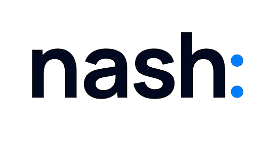

<p align="center">
  <picture>
    <source media="(prefers-color-scheme: dark)" srcset="client/public/assets/nash_dark.png">
    
  </picture>
</p>

<p align="center">
  <strong>AI chat for everyone — one interface, every model.</strong>
</p>

<p align="center">
  <a href="#quick-start">Quick Start</a> &bull;
  <a href="#architecture">Architecture</a> &bull;
  <a href="#features">Features</a> &bull;
  <a href="#development">Development</a> &bull;
  <a href="#deployment">Deployment</a> &bull;
  <a href="#license">License</a>
</p>


---

**Nash** is an open-source, full-stack AI chat application that gives users
unified access to models from OpenAI, Anthropic, Google, xAI, Cohere, AWS
Bedrock, and more — all through a single, polished interface. It uses
[Backboard.io](https://backboard.io) as the AI gateway and data layer, and a
React frontend forked from [LibreChat](https://github.com/danny-avila/LibreChat).

## Quick Start

**Prerequisites:** Python **3.11+**, Node **20+**, [uv](https://docs.astral.sh/uv/),
and Docker Desktop running (required — `make dev` brings up a DynamoDB Local
sidecar on `:8100`).

```bash
git clone https://github.com/Backboard-io/Nash.git
cd Nash
cp .env.example .env   # generate ENCRYPTION_KEY (openssl rand -hex 16)
make dev               # installs deps, starts DynamoDB Local, API, and frontend
```

Then open [http://localhost:3090](http://localhost:3090) and paste your
Backboard API key (from [app.backboard.io/settings](https://app.backboard.io/settings)) —
that's the whole sign-in.


| Service | URL                                            |
| ------- | ---------------------------------------------- |
| App     | [http://localhost:3090](http://localhost:3090) |
| API     | [http://localhost:3080](http://localhost:3080) |


Logs stream to `/tmp/nash-api.log` and `/tmp/nash-frontend.log`.

> **Backboard.io account.** Most Nash flows talk to Backboard for AI
> orchestration and persistent storage. Sign-in is bring-your-own-key: each
> user pastes their Backboard API key (from
> [app.backboard.io/settings](https://app.backboard.io/settings)) on the
> login page. Nash encrypts that key in the server-side session and never
> falls back to a shared application key. See
> [docs/byok-flow.md](docs/byok-flow.md).

## Architecture

```
┌──────────────────────┐        ┌──────────────────────┐
│                      │        │                      │
│   React Frontend     │───────▶│   Flask API          │
│   Vite  · Tailwind   │  REST  │   Python · Pydantic  │
│   :3090              │  SSE   │   :3080              │
│                      │        │                      │
└──────────────────────┘        └──────────┬───────────┘
                                           │
                          ┌────────────────┴────────────────┐
                          │                                 │
                          ▼                                 ▼
                   ┌──────────────┐                ┌──────────────┐
                   │  Backboard   │                │   DynamoDB   │
                   │  LLM gateway │                │   sessions   │
                   │  assistants  │                │  + user state│
                   │  threads     │                │  (nash_state)│
                   │  memories    │                └──────────────┘
                   │  documents   │
                   └──────────────┘
```

**Backend** — Python/Flask API handles auth, chat streaming (SSE), file uploads, and all business logic. User records, sessions, and per-user assistant pointers live in a DynamoDB table (`nash_state`); LLM chat, threads, memories, and documents go through Backboard.

**Frontend** — React app built with Vite and Tailwind. Communicates with the API over REST and Server-Sent Events for real-time chat streaming.

**Backboard.io** — The AI gateway and the storage backend for chat-side data — assistants, threads, memories, and documents. User identity, sessions, and Nash-internal state live in DynamoDB.

## Features

**Multi-provider AI** — Access 100+ models across OpenAI, Anthropic, Google, xAI, Cohere, Cerebras, AWS Bedrock, and OpenRouter through a single interface.

**Custom Agents** — Create agents with custom instructions that persist across conversations. Each agent's configuration is stored in Backboard.

**File-Aware Chat** — Upload documents and images directly into conversations. Files are indexed in Backboard for retrieval-augmented generation.

**Conversations & Memory** — Full conversation history with folders, tags, search, and shared links. User-level memory that the AI retains across threads.

**API-key sign-in** — Paste a Backboard API key once; Nash validates it,
provisions your assistant, and stores the key AES-256-GCM-encrypted in a
server-side DynamoDB session. No passwords, no OAuth apps, no email setup.

**Prompts & Presets** — Save and reuse prompt templates and model presets across conversations.

## Tech Stack


| Layer     | Technology                                                     |
| --------- | -------------------------------------------------------------- |
| Backend   | Python 3.11+, Flask, Pydantic, `backboard-sdk`                 |
| Frontend  | React 18, Vite, Tailwind CSS, Turborepo                        |
| Auth      | Backboard BYOK API keys (encrypted server-side sessions)       |
| Data & AI | Backboard.io (assistants, threads, memories, docs)             |
| Sessions  | DynamoDB (local via Docker, or AWS-managed)                    |
| Deploy    | Docker multi-stage build (`Dockerfile` + `docker-compose.yml`) |


## Project Structure

```
Nash/
├── api/                    # Active Flask backend (Python)
│   ├── app.py              #   Flask app factory
│   ├── config.py           #   Pydantic settings
│   ├── middleware/         #   Session auth, CSRF, rate limiting
│   ├── routes/             #   All API endpoints
│   └── services/           #   Backboard, users, dynamo
├── client/                 # React + Vite frontend
│   ├── src/                #   App source
│   └── dist/               #   Production build (gitignored)
├── packages/               # Shared monorepo packages (forked from LibreChat)
├── scripts/                # Model-catalog sync script
├── docs/                   # Architecture & operational docs
├── librechat.yaml          # Model & endpoint catalog
├── Dockerfile              # Multi-stage production build
├── docker-compose.yml      # Local app + DynamoDB stack
├── Makefile                # Dev entry point + common tasks
└── pyproject.toml          # Python dependencies (uv)
```

## Development

```bash
make install     # install JS + Python dependencies (npm + uv)
make dev         # build frontend and start API + frontend
make backend     # run only the Flask API
make frontend    # run only the Vite dev server
make build       # build the frontend (Turbo)
make test        # run the supported test suite
```

### DynamoDB Local commands

`make dev` brings up DynamoDB Local automatically. These targets are escape
hatches for the API-only flow (`make backend`) or for troubleshooting:

```bash
make dynamo-up        # start the container on :8100
make dynamo-init      # create the `nash` table
make dynamo-down      # stop and remove
```

### Sync the model catalog

`librechat.yaml` is the source of truth for the model selector and pricing.
Keep it aligned with Backboard's live `/api/models/provider/{provider}` data
with the sync script (requires `BACKBOARD_API_KEY` in `.env` or the env):

```bash
.venv/bin/python scripts/diff-backboard-models.py            # --check (default), exit 1 on drift
.venv/bin/python scripts/diff-backboard-models.py --write    # rewrite librechat.yaml from live data
```

`--write` rebuilds `endpoints.custom[].models.default`, `modelPricing`, and
prunes stale entries from `selectorTiers`. Curated keys (`name`, `apiKey`,
`baseURL`, `titleConvo`, `titleModel`, `modelDisplayLabel`) are preserved.
Restart the API to pick up the change — the config is cached at startup.

### More docs

- [docs/byok-flow.md](docs/byok-flow.md) — BYOK encryption + DynamoDB session flow
- [docs/mcp-google-workspace-setup.md](docs/mcp-google-workspace-setup.md) — Optional Google Workspace MCP tools

## Deployment

Production builds use a multi-stage Docker image — Node builds the frontend,
then Python serves everything via Gunicorn.

```bash
docker build -t nash:latest .
docker run --rm -p 3080:3080 --env-file .env nash:latest
```

For a local end-to-end stack (app + DynamoDB) use the included compose file:

```bash
docker compose up --build
```

The container exposes port `3080` and reads its configuration from environment
variables — see `.env.example` for the full list. Secrets (`ENCRYPTION_KEY`,
`FLASK_SECRET_KEY`) should be supplied by your platform's secret manager
rather than baked into the image.

Nash itself has no preferred hosting target; any platform that can run a
Linux container with environment variables and outbound internet to
Backboard works (Fly.io, Render, Railway, ECS, App Runner, Cloud Run, Kubernetes,
a single VM with Docker, etc.).

## License

Nash is released under the [MIT License](LICENSE).

The frontend (`client/`) and several shared packages under `packages/` are
derived from [LibreChat](https://github.com/danny-avila/LibreChat) (also MIT).
See [NOTICE](NOTICE) for full attribution.

## Contributing

Issues and pull requests are welcome — please read [CONTRIBUTING.md](CONTRIBUTING.md)
first. To report a security vulnerability, follow the process in [SECURITY.md](SECURITY.md)
rather than opening a public issue.
