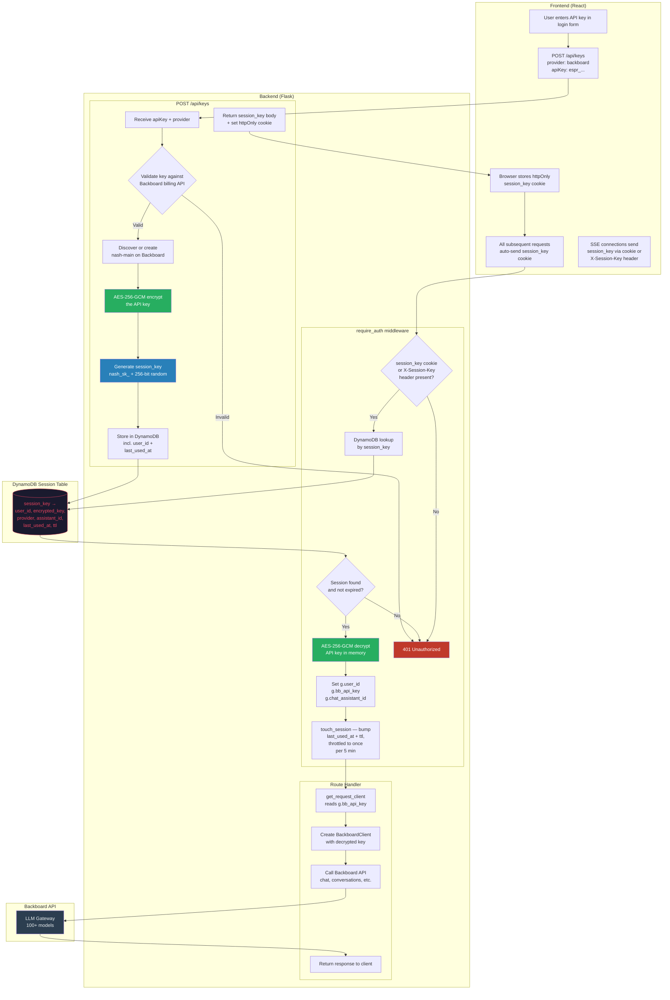
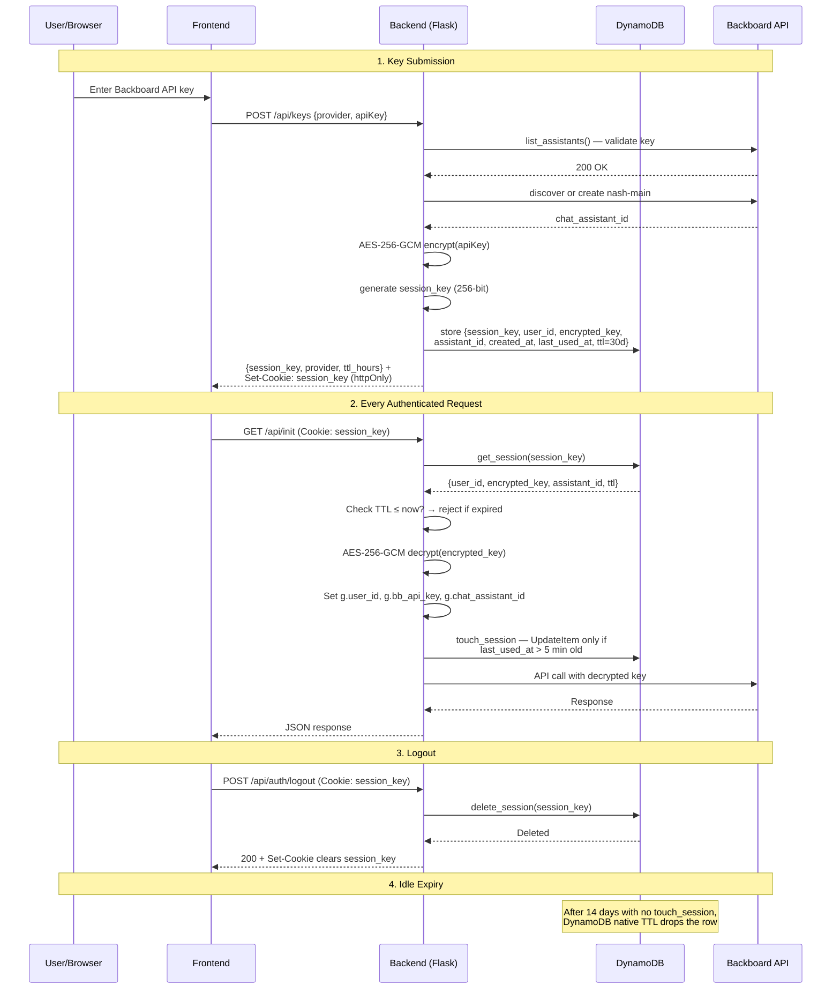

# BYOK (Bring Your Own Key) — Architecture & Flow

> **Post-migration note (May 2026).** Earlier revisions of this doc described
> a two-token model (a JWT for identity + a `session_key` cookie for the
> encrypted BYOK key) and called the session row a "blind store" with no
> user identity. After the JWT removal, the session_key cookie is the **only**
> auth credential and the session row now carries a `user_id` field so it can
> power identity-aware routes (admin, share-links) that used to require a
> JWT. The encryption-key isolation property is unchanged — the BYOK material
> is still AES-256-GCM wrapped at rest. If you see references to JWTs,
> refresh tokens, or "blind store — no user identity" anywhere downstream,
> those are stale.

## Flow Chart



## Session Lifecycle



## DynamoDB Schema

Nash uses **two** DynamoDB tables. The session table (`nash`) holds one
row per active login, identified by an opaque `session_key`. User identity
and profile data live in the separate `nash_state` table (see
[api/services/state_service.py](../api/services/state_service.py)) as
`PROFILE#<user_id>` rows with `EMAIL#<email>` and `SUB#<backboard_sub>`
lookup-index rows pointing back to the canonical profile.

```
Table: nash  (sessions)
Key: session_key (String, HASH)
TTL: ttl (Number, epoch seconds — sliding, bumped on use)

Item:
┌──────────────────┬──────────────────────────────────────────┐
│ session_key      │ nash_sk_9Ft7rA2-0AL9mgcvLO8zl5Qxy...     │
│ user_id          │ <Nash user id — usually sha256(api_key)> │
│ encrypted_key    │ JV21oZtneJygn88CrHUHubQpadUm...          │
│ provider         │ backboard                                │
│ chat_assistant_id│ a1b2c3d4-...                             │
│ created_at       │ 2026-05-20T08:50:38+00:00                │
│ last_used_at     │ 1779000000                               │
│ ttl              │ 1779950400                               │
└──────────────────┴──────────────────────────────────────────┘

Table: nash_state  (user identity + Nash-internal state)
Key: pk (String, HASH) — e.g. PROFILE#<user_id>, EMAIL#<email>, SUB#<sub>
```

## Security Properties

| Property | Implementation |
|----------|---------------|
| Key at rest | AES-256-GCM encrypted in DynamoDB |
| Key in transit | HTTPS + httpOnly cookie |
| Key in memory | Only during request, garbage collected after |
| Key in logs | Never — audit logs only record event names |
| Key in response | Never — only session_key returned to client |
| Session entropy | 256-bit (secrets.token_urlsafe) |
| Session TTL | 30 days sliding by default (configurable via `SESSION_TTL_DAYS`) |
| TTL bumping | Throttled to once per `SESSION_TOUCH_MIN_INTERVAL_SECONDS` (default 300) |
| TTL enforcement | Double: application check + DynamoDB native TTL |
| Identity in session row | `user_id` only — no email, name, or secrets |
| Logout | Deletes the DynamoDB row — immediate revocation, replica-agnostic |
| Cookie flags | httpOnly, Secure (in prod), SameSite=Lax |
